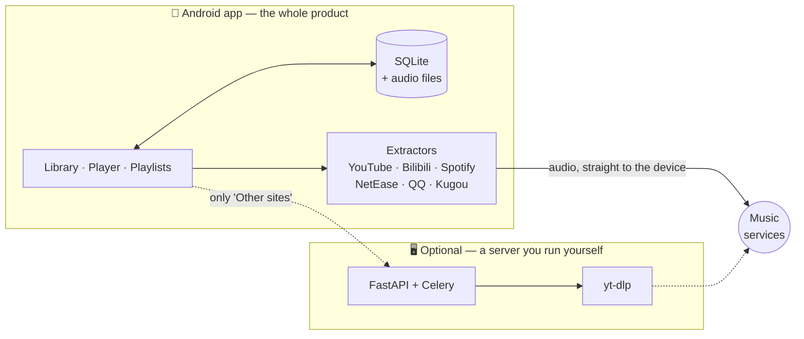

<div align="center">


# MiO

**Your music, on your phone.**

A local-first music library manager for Android. The library, the downloads and the
playback all happen on the device — no account, no subscription, and no server
holding your music.

<p>
  <a href="https://github.com/DylanYu314/MiO-releases/releases/latest"></a>
  
  
  
  <a href="./LICENSE"></a>
</p>

<p>
  <a href="./README.md"></a>
  <a href="./README.zh-CN.md"></a>
</p>

<a href="https://github.com/DylanYu314/MiO-releases/releases/latest"></a>

<sub>Also at <a href="https://mio.dlany.uk/download/">mio.dlany.uk/download</a> · <a href="https://mio.dlany.uk">Website</a> · <a href="https://mio.dlany.uk/privacy/">Privacy</a></sub>

</div>

> 🇨🇳 **In mainland China, the button above will not download.**
> → **[Use this link instead](#china)**

---

> **For personal use, with content you have the right to download.** MiO is free.
> Nothing is sold and no service is operated — donations, if any, grant no
> features, no tier and no key.

> **About this repository.** This is MiO's **release repository**: the source as
> published, plus every build. Development happens in a private repository, so
> the history here starts at the first public release rather than at the first
> commit — the code is all of it, the commit log is not.

## Contents

- [What MiO is](#what-mio-is)
- [Features](#features)
- [Installing](#installing)
- [Updates](#updates)
- [Downloading from mainland China](#china)
- [How it works](#how-it-works)
- [Tech stack](#tech-stack)
- [Repository layout](#repository-layout)
- [Running it](#running-it)
- [Development](#development)
- [Licence](#licence)

## What MiO is

MiO turns a link, a search or a playlist from somewhere else into audio files that
live on the phone. It imports from Spotify, YouTube, Bilibili, NetEase Cloud
Music, QQ Music and Kugou; it scores every match and shows them for review before
a single byte is downloaded; and it plays what it collects with lock-screen
controls, a ten-band equaliser, crossfade and a sleep timer.

**The app needs no server.** Installing the APK gets a complete music app — the
library, search, downloads, imports and playback all run on the device, and the
audio is fetched by the phone itself. One optional feature, *Other sites*, hands a
link to yt-dlp for the hundreds of sites the phone has no extractor for; that is
the only part that needs a backend, and it is one you run yourself
— the Python service in this repository, which you run yourself.

Released and publicly downloadable: **v1.0.1**, Android 7.0+, 64- and 32-bit ARM,
69 MB. Builds are published from
[`DylanYu314/MiO-releases`](https://github.com/DylanYu314/MiO-releases), which is
where the APK, the release notes and the update manifest live.

## Features

| | |
|---|---|
| 🎧 **A real player** | Lock-screen and Bluetooth controls, a proper queue with shuffle and repeat, crossfade, a ten-band equaliser, mono, balance, volume levelling and a sleep timer |
| 📥 **Three ways to add music** | Paste a link, search, or import a playlist — and in all three the phone fetches its own audio |
| 🔁 **Playlist import** | Spotify, YouTube, Bilibili, NetEase Cloud Music, QQ Music and Kugou. Matches are scored and reviewable; nothing downloads until you confirm |
| 💾 **Local-first** | Library, playlists, favourites and audio files live on the device, in SQLite and ordinary files. There is no account and nothing to sign up for |
| 📤 **Copy a library between phones** | Export to a versioned JSON file and load it on another device. No audio is transferred — the receiving phone fetches its own |
| 🔄 **Updates that arrive on their own** | Most fixes download in the background and apply on the next launch; the app says so when a new APK is genuinely needed |
| 🌍 **Seven languages** | English, 简体中文, Español, Français, 日本語, 한국어, Русский |
| 🔒 **No telemetry** | No adverts, no tracking, no paid tier. The diagnostics log carries no song titles and no personal details, and stays on the phone unless you point MiO at a server of your own |

## Installing

1. Tap **Download for Android** above and open the file when it finishes.
2. Android will ask whether to allow installing from your browser — it may be
   worded *"Install unknown apps"*. Allow it once.
3. Tap **Install**, then open MiO.

**Android will warn you, and the warning is correct.** MiO does not come from an
app store, so your phone has no way to vouch for it. That is expected and nothing
has gone wrong. MiO is not on Google Play or the App Store and will not be — both
stores prohibit what it does.

**What you need:** Android 7.0 (Nougat) or newer, on any phone — 64-bit and
32-bit ARM are both included. About 69 MB to download, plus room for the music
you add.

Installing a newer MiO over an older one **keeps your library**. You never need
to uninstall first.

## Updates

Most fixes arrive on their own: MiO checks when it starts, downloads in the
background, and applies the fix the next time you open it. Nothing to tap.

Occasionally a change needs a whole new APK. The app will tell you when that
happens, and the file will be here.

<a id="china"></a>

## Downloading from mainland China 🇨🇳

The GitHub release **page** opens from mainland China, but the **file attached to
it will not download** — attachments are served from `githubusercontent.com`,
which is unreachable there. `dl.dlany.uk` is unreachable too.

**Use this link instead** — it is the same file, and it has been verified
downloading in full (all 69 MB) from mainland China:

**⬇ [https://pub-6eb86219220840aa84b5dd9ecde0059c.r2.dev/MiO-v1.0.1.apk](https://pub-6eb86219220840aa84b5dd9ecde0059c.r2.dev/MiO-v1.0.1.apk)**

Once it is installed, the app's own update check uses that same host, so updates
keep arriving normally.

### Every download link

All three are the same file, byte for byte.

| Source | Reachable from mainland China |
|---|---|
| [`pub-…r2.dev`](https://pub-6eb86219220840aa84b5dd9ecde0059c.r2.dev/MiO-v1.0.1.apk) | ✅ yes — measured |
| [`dl.dlany.uk`](https://dl.dlany.uk/MiO-v1.0.1.apk) | ❌ no |
| [GitHub release asset](https://github.com/DylanYu314/MiO-releases/releases/latest) | ❌ no — the page loads, the download fails |

---

## How MiO is built

The rest of this page is for anyone reading the code.

## How it works

The phone is the origin. It holds the library and it fetches its own audio,
because a server cannot do that job: YouTube refuses a datacentre address on
every client — measured at **1 import in 14** — while a phone on a residential
connection is not refused.



## Tech stack

| | |
|---|---|
| **Android app** | React Native 0.86 · Expo SDK 57 · TypeScript · expo-router · SQLite (`expo-sqlite`) · Zustand · TanStack Query · i18next |
| **Native modules** | Kotlin — a ten-band equaliser over `DynamicsProcessing`, a media3 `MediaSession`, a `dataSync` foreground service, and a share-intent reader. Two Expo config plugins patch `expo-audio` at prebuild for a single media session and a mono audio processor |
| **Backend** (optional) | Python 3.12 · FastAPI · Celery + Redis · SQLAlchemy 2.0 + Alembic · SQLite · yt-dlp + ffmpeg + mutagen |
| **Website** | React · TypeScript · Vite · Tailwind CSS — the download and privacy pages at `mio.dlany.uk` |
| **Tooling** | Docker · GitHub Actions · Renovate · ruff · ESLint + Prettier · jest · Vitest · Playwright · EAS |

## Repository layout

```
mobile/     The Android app — this is the product
  app/        expo-router screens (library, player, playlists, add, settings)
  src/        library, player store, extractors, i18n, diagnostics
  modules/    Kotlin native modules
  plugins/    Expo config plugins that patch expo-audio at prebuild
backend/    Optional FastAPI service: import pipeline, Celery tasks, yt-dlp
frontend/   The website: the download and privacy pages
shared/     Design tokens and the i18n catalogues both clients build against
docs/adr/   Architecture decision records — one file per decision
logo/       The master mark; every app icon is generated from it
```

## Running it

**The app.** A release APK is at [mio.dlany.uk/download](https://mio.dlany.uk/download/)
or in the [releases repository](https://github.com/DylanYu314/MiO-releases/releases/latest).
To run it from source you need a development build — Expo Go cannot work here,
because the lock-screen controls come from config plugins that never reach its
prebuilt binary:

```bash
cd mobile
npm install
npx expo start --dev-client
```

Most JavaScript changes ship over the air and never need a rebuild; native code
does, and `npm run ota:check` is what decides which.

**The optional backend**, from the repository root:

```bash
docker compose up --build   # Redis, the API on :8000, and a worker
```

Swagger UI is at `http://localhost:8000/docs`.

⛔ **Mint an access key before opening a port to the internet.** `POST /jobs` is
the only endpoint that costs a server anything, and it is gated for that reason:
`docker compose exec backend python -m scripts.access_keys create --label "…"`
prints a token once.

> Rebuild with `--build` after changing `backend/pyproject.toml` — the code is
> mounted into the containers, but dependencies are baked into the image. And
> restart the worker after backend changes: unlike the API, it does not
> hot-reload.

**The website**, from `frontend/` (Node 22+):

```bash
npm install
npm run dev                 # http://localhost:5173
```

## Development

```bash
# mobile/
npm run typecheck && npm run lint && npm run format:check && npm test

# backend/  (needs uv)
uv sync --frozen && alembic upgrade head
ruff check . && ruff format --check . && pytest

# frontend/
npm run lint && npm run format:check && npm run typecheck
npm run test          # Vitest
npm run test:e2e      # Playwright, against a real backend on a disposable database
```

## Licence

[GNU AGPL-3.0](./LICENSE). Not affiliated with YouTube, Spotify, Bilibili,
NetEase Cloud Music, QQ Music or Kugou.
