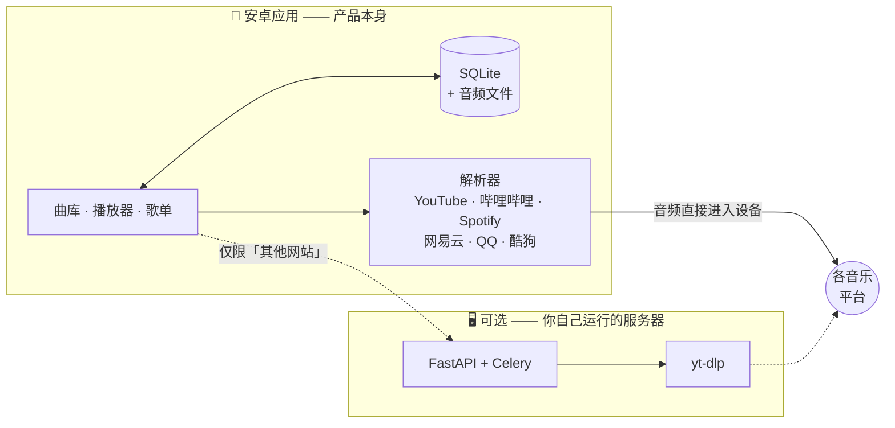

<div align="center">


# MiO

**你的音乐，存在你自己的手机里。**

一个本地优先的安卓音乐库管理器。曲库、下载和播放全部发生在设备上——没有账号，
没有订阅，也没有一台替你保管音乐的服务器。

<p>
  <a href="https://github.com/DylanYu314/MiO-releases/releases/latest"></a>
  
  
  
  <a href="./LICENSE"></a>
</p>

<p>
  <a href="./README.md"></a>
  <a href="./README.zh-CN.md"></a>
</p>

<a href="https://pub-6eb86219220840aa84b5dd9ecde0059c.r2.dev/MiO-v1.1.0.apk"></a>

<sub>也可以从 <a href="https://mio.dlany.uk/download/">mio.dlany.uk/download</a> 下载 · <a href="https://mio.dlany.uk/privacy/">隐私政策</a></sub>

</div>

> 🇨🇳 **中国大陆用户请注意：不要走 Releases 页面下载。**
> 上面这个按钮已经指向可用的地址，原因和其他备用地址见
> **[从中国大陆下载](#china)**。

---

> **仅供个人使用，且限于你有权下载的内容。** MiO 是免费的。它不出售任何东西，也不
> 运营任何服务——即便有捐赠，也不会因此获得任何功能、任何等级或任何密钥。

> **关于这个仓库。** 这里是 MiO 的**发布仓库**：对外发布的源码，以及全部构建产物。
> 开发在一个私有仓库里进行，所以这里的提交历史从第一个公开版本开始，而不是从第一次
> 提交开始——代码是完整的，提交记录不是。

## 目录

- [MiO 是什么](#mio-是什么)
- [功能](#功能)
- [安装](#安装)
- [更新](#更新)
- [从中国大陆下载](#china)
- [它是怎么工作的](#它是怎么工作的)
- [技术栈](#技术栈)
- [仓库结构](#仓库结构)
- [运行](#运行)
- [开发](#开发)
- [许可证](#许可证)

## MiO 是什么

MiO 把一个链接、一次搜索或者别处的一份歌单，变成存在手机上的音频文件。它支持从
Spotify、YouTube、哔哩哔哩、网易云音乐、QQ 音乐和酷狗导入；每一条匹配都会打分并
交给你确认，在此之前不会下载任何一个字节；它也会把收下来的音乐播放出来——锁屏控制、
十段均衡器、交叉淡入淡出和睡眠定时器。

**这个应用不需要服务器。** 装上 APK 就是一个完整的音乐应用——曲库、搜索、下载、导入
和播放都在设备上运行，音频也由手机自己获取。只有一个可选功能*其他网站*会把链接交给
yt-dlp，用来处理手机没有内置解析器的那几百个站点；那是唯一需要后端的部分，而那台
后端由你自己运行——也就是本仓库里的这个 Python 服务。

已发布并可公开下载：**v1.0.1**，Android 7.0 及以上，64 位与 32 位 ARM，69 MB。
构建产物发布在
[`DylanYu314/MiO-releases`](https://github.com/DylanYu314/MiO-releases)——APK、
更新说明和更新清单都在那里。

## 功能

| | |
|---|---|
| 🎧 **一个像样的播放器** | 锁屏与蓝牙控制、带随机和循环的播放队列、交叉淡入淡出、十段均衡器、单声道、左右声道平衡、音量均衡和睡眠定时器 |
| 📥 **三种添加音乐的方式** | 粘贴链接、搜索，或导入歌单——三种方式里音频都由手机自己获取 |
| 🔁 **歌单导入** | Spotify、YouTube、哔哩哔哩、网易云音乐、QQ 音乐和酷狗。匹配结果会打分并可逐条确认，你点确认之前不会下载 |
| 💾 **本地优先** | 曲库、歌单、收藏和音频文件都在设备上，存成 SQLite 和普通文件。没有账号，也没有任何需要注册的东西 |
| 📤 **把曲库复制到另一台手机** | 导出成一个带版本号的 JSON 文件，在另一台设备上载入。过程中不传输任何音频——接收的那台手机自己去取 |
| 🔄 **会自己送达的更新** | 大多数修复在后台下载，下次启动时生效；确实需要新 APK 的时候，应用会告诉你 |
| 🌍 **七种语言** | English、简体中文、Español、Français、日本語、한국어、Русский |
| 🔒 **没有遥测** | 没有广告，没有追踪，没有付费档。诊断日志不含歌曲名，也不含任何个人信息，并且只留在手机上——除非你把 MiO 指向你自己的服务器 |

## 安装

1. 点上面的**下载安卓版**，下载完成后打开这个文件。
2. 安卓会问要不要允许从你的浏览器安装应用，措辞可能是*「安装未知应用」*。允许一次即可。
3. 点**安装**，然后打开 MiO。

**安卓会向你发出警告，而这个警告是对的。** MiO 不来自应用商店，所以你的手机没有办法
为它背书。这是预期之内的，没有出任何问题。MiO 不在 Google Play 或 App Store 上，以后
也不会——这两个商店都禁止它所做的事。

**运行条件：** Android 7.0（Nougat）及以上，任意手机均可——64 位和 32 位 ARM 都包含
在内。下载约 69 MB，另外还需要放你添加的音乐的空间。

用新版覆盖安装旧版**会保留你的曲库**，不需要先卸载。

## 更新

大多数修复会自己送达：MiO 在启动时检查，在后台下载，下次打开时生效。你什么都不用点。

偶尔有的改动需要一个全新的 APK。到那时应用会告诉你，文件也会在这里。

<a id="china"></a>

## 从中国大陆下载 🇨🇳

GitHub 的 Releases **页面**在中国大陆可以打开，但**挂在上面的附件下载不了**——附件由
`githubusercontent.com` 提供，该域名在中国大陆无法访问。`dl.dlany.uk` 同样无法访问。

**请用下面这个地址**——文件完全相同，并且已经由中国大陆用户实测，69 MB 可以完整
下载：

**⬇ [https://pub-6eb86219220840aa84b5dd9ecde0059c.r2.dev/MiO-v1.1.0.apk](https://pub-6eb86219220840aa84b5dd9ecde0059c.r2.dev/MiO-v1.1.0.apk)**

装好之后，应用内的更新检查也走这个地址，所以后续更新可以正常收到。

### 全部下载地址

三个地址是同一个文件，逐字节相同。

| 地址 | 中国大陆可访问 |
|---|---|
| [`pub-…r2.dev`](https://pub-6eb86219220840aa84b5dd9ecde0059c.r2.dev/MiO-v1.1.0.apk) | ✅ 可以——已实测 |
| [`dl.dlany.uk`](https://dl.dlany.uk/MiO-v1.1.0.apk) | ❌ 不行 |
| [GitHub Releases 附件](https://github.com/DylanYu314/MiO-releases/releases/latest) | ❌ 不行——页面能打开，下载会失败 |

---

## MiO 是怎么做出来的

下面的内容是给读代码的人看的。

## 它是怎么工作的

手机是源头。曲库在手机上，音频也由手机自己获取，因为这件事服务器做不了：YouTube 会
拒绝来自机房地址的请求，所有客户端都一样——实测**每 14 次导入只成功 1 次**——而住宅
网络上的手机不会被拒绝。



## 技术栈

| | |
|---|---|
| **安卓应用** | React Native 0.86 · Expo SDK 57 · TypeScript · expo-router · SQLite（`expo-sqlite`）· Zustand · TanStack Query · i18next |
| **原生模块** | Kotlin —— 基于 `DynamicsProcessing` 的十段均衡器、一个 media3 `MediaSession`、一个 `dataSync` 前台服务，以及一个分享意图读取器。两个 Expo config plugin 在 prebuild 阶段改写 `expo-audio`，用于单一媒体会话和单声道音频处理 |
| **后端**（可选） | Python 3.12 · FastAPI · Celery + Redis · SQLAlchemy 2.0 + Alembic · SQLite · yt-dlp + ffmpeg + mutagen |
| **网站** | React · TypeScript · Vite · Tailwind CSS —— `mio.dlany.uk` 上的下载页和隐私政策页 |
| **工具链** | Docker · GitHub Actions · Renovate · ruff · ESLint + Prettier · jest · Vitest · Playwright · EAS |

## 仓库结构

```
mobile/     安卓应用 —— 产品本身
  app/        expo-router 页面（曲库、播放器、歌单、添加、设置）
  src/        曲库、播放器状态、解析器、i18n、诊断
  modules/    Kotlin 原生模块
  plugins/    在 prebuild 阶段改写 expo-audio 的 Expo config plugin
backend/    可选的 FastAPI 服务：导入流水线、Celery 任务、yt-dlp
frontend/   网站：下载页和隐私政策页
shared/     两端共用的设计 token 和 i18n 语言包
docs/adr/   架构决策记录 —— 一个决定一个文件
logo/       图标母版；所有应用图标都由它生成
```

## 运行

**应用本身。** 发布版 APK 在
[mio.dlany.uk/download](https://mio.dlany.uk/download/) 或
[发布仓库](https://github.com/DylanYu314/MiO-releases/releases/latest)。
要从源码运行，你需要一个 development build——Expo Go 在这里用不了，因为锁屏控制来自
config plugin，而它们进不了 Expo Go 的预编译二进制：

```bash
cd mobile
npm install
npx expo start --dev-client
```

大多数 JavaScript 改动是静默下发的，不需要重新构建；原生代码则需要，
`npm run ota:check` 就是用来判断属于哪一种的。

**可选的后端**，在仓库根目录：

```bash
docker compose up --build   # Redis、跑在 :8000 的 API，和一个 worker
```

Swagger UI 在 `http://localhost:8000/docs`。

⛔ **在把端口开放到公网之前，先生成一把访问密钥。** `POST /jobs` 是唯一会消耗服务器
资源的接口，它被拦住正是因为这一点：
`docker compose exec backend python -m scripts.access_keys create --label "…"`
会打印一次令牌。

> 改过 `backend/pyproject.toml` 之后要用 `--build` 重建——代码是挂载进容器的，但依赖
> 是烤进镜像的。改过后端代码之后还要重启 worker：它和 API 不一样，不会热重载。

**网站**，在 `frontend/`（需要 Node 22+）：

```bash
npm install
npm run dev                 # http://localhost:5173
```

## 开发

```bash
# mobile/
npm run typecheck && npm run lint && npm run format:check && npm test

# backend/（需要 uv）
uv sync --frozen && alembic upgrade head
ruff check . && ruff format --check . && pytest

# frontend/
npm run lint && npm run format:check && npm run typecheck
npm run test          # Vitest
npm run test:e2e      # Playwright，对着真实后端和一个用完即弃的数据库跑
```

## 许可证

版权所有 © 2026 Dylan Yu。自由软件，采用
[GNU AGPL-3.0](./LICENSE) 许可。与 YouTube、Spotify、哔哩哔哩、网易云音乐、QQ 音乐或酷狗
均无关联。
